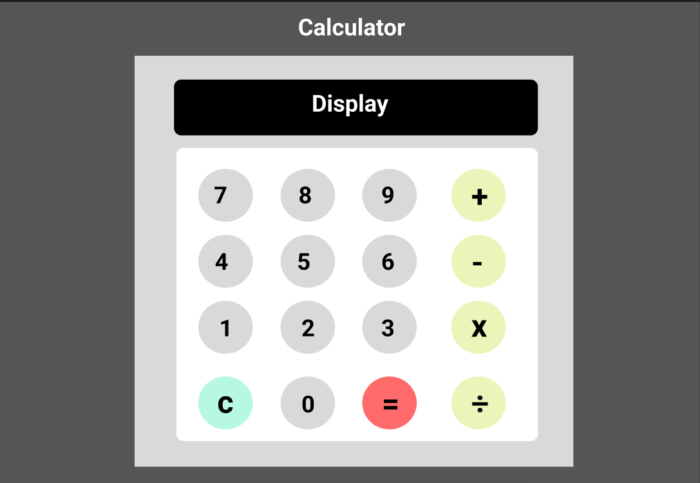

# Design

## Project's design overview

> The **Elementary Calculator** is designed with simplicity and functionality in mind. It features a clear display screen and buttons for basic arithmetic operations. The layout is responsive and works on both desktop and mobile devices.

---

## Wireframe(s)

> A basic wireframe represents the calculator layout with a display at the top and buttons arranged in a grid.

### Link to wireframe:

